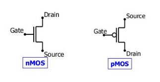
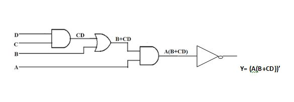
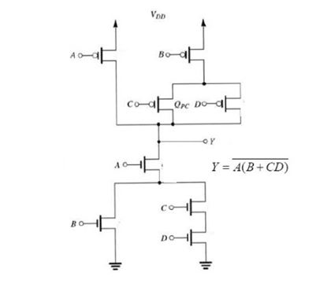

# Simulation of CMOS Digital Circuits Using PSPICE

## Project Objective
- Design and simulate a CMOS digital circuit in PSPICE based on a Boolean expression.
- Implement complementary NMOS and PMOS transistors to realize digital logic.
- Demonstrate low-power CMOS logic and verify circuit functionality through simulation.

## Tools & Technologies
- **Software:** ORCAD PSPICE
- **Components:** NMOS and PMOS transistors, voltage sources
- **Logic:** CMOS logic gates (NAND, NOR, Inverter)
- **Other:** Probes for waveform analysis

### Metal-Oxide-Semiconductor Field-Effect Transistor (MOSFET) & CMOS Logic Overview

  - The **Metal-Oxide-Semiconductor Field-Effect Transistor (MOSFET)** is a voltage-controlled device widely used in digital circuits.
It has three terminals: **Gate (G)**, **Drain (D)**, and **Source (S)**.
MOSFETs offer extremely high input resistance and negligible gate current, making them ideal for digital switching.

MOSFETs are classified into **NMOS** and **PMOS** types.
These two devices operate in a complementary manner and together form the basis of **CMOS logic**, enabling high noise margin and reliable digital switching.

#### NMOS vs PMOS

- **NMOS (N-channel MOSFET):**     
  - Built on P-type substrate, conducts when **gate voltage is HIGH** 
  - Exhibits higher electron mobility, resulting in faster switching speed
  - Commonly used in the **pull-down network (PDN)** of CMOS circuits.
 
- **PMOS (P-channel MOSFET):**
  - Built on N-type substrate, conducts when **gate voltage is LOW**
  - Complements NMOS to provide high noise margin and reliable digital switching in CMOS logic.
  - Used in the **pull-up network (PUN)** of CMOS circuits to provide a stable logic HIGH level.

#### MOSFET are available in two basic forms:
  - **Depletion Type MOSFET:** Conduction occurs at VGS = 0; requires a gate voltage of opposite polarity to switch OFF.                                      Included for conceptual understanding.
  
  - **Enhancement Type MOSFET:** Normally OFF and requires VGS > Vth to turn ON; all devices in this project are                                     enhancement-mode, consistent with modern CMOS design practices.

### Complementary Metal-Oxide-Semiconductor (CMOS)

 - CMOS (Complementary Metal-Oxide-Semiconductor) logic employs both NMOS and PMOS transistors such that only one transistor network conducts in the steady state.
 - This complementary operation results in negligible static power dissipation, high noise immunity, and efficient switching behavior

A CMOS inverter consists of a **PMOS pull-up network** and an **NMOS pull-down network**.
  - When the input is HIGH, NMOS conducts and PMOS turns OFF, producing a LOW output.
  - When the input is LOW, PMOS conducts and NMOS turns OFF, producing a HIGH output.

#### Boolean Expression Using Logic Gates

The Boolean expression is first realized using conventional logic gates such as **NAND** and **NOR**. This step helps in verifying the correctness of the logic function before implementing it using MOS transistors.

Boolean Expression: Y = (A(B + CD))'

  

#### Boolean Expression Using MOS Transistors

#### CMOS LOGIC:

  In static CMOS logic, logic gates are implemented using complementary pull-up and pull-down networks:

  -	For implementing NAND gate N-MOS is connected in series and P-MOS in parallel.
  -	For implementing NOR gate N-MOS is connected in parallel and P-MOS in series.

This duality ensures correct logic functionality while maintaining very low static power dissipation.

### Steps to Realize Boolean Expression (`Y = (A(B + CD))'`)         

- **B:** Series in PMOS, parallel in NMOS                     
- **C and D:** Parallel in PMOS, series in NMOS               
- **A:** Included in both PMOS and NMOS networks
- **Output Y:** Taken from the common drain node

#### CMOS Implementation Rules

<table>
<tr>
<th>Network</th>
<th>Series Connection</th>
<th>Parallel Connection</th>
</tr>
<tr>
<td><strong>NMOS</strong></td>
<td style="text-align:center;">AND</td>
<td style="text-align:center;">OR</td>
</tr>
<tr>
<td><strong>PMOS</strong></td>
<td style="text-align:center;">OR</td>
<td style="text-align:center;">AND</td>
</tr>
</table>

Note: The AND/OR terms describe the conduction behavior of NMOS and PMOS networks. The final gate logic (NAND/NOR) results from the complementary pull-up and pull-down configuration.

### Significance of CMOS in Digital Circuit Design
- Low Static Power Dissipation: Only negligible current flows in steady state; power is consumed primarily in switching events.
- High Integration Density: Complementary design allows more logic gates to be packed on a single chip.
- Robust Noise Margin: Reliable operation even under voltage fluctuations.
- Scalability: Supports large-scale integration, making it ideal for modern VLSI and high-performance digital systems.

### Simulation Procedure
1. Open PSPICE and create a new project.
2. Draw the CMOS circuit according to the Boolean expression.
3. Assign NMOS and PMOS models with appropriate parameters.
4. Apply input voltages and run transient analysis.
5. Observe the output waveform and verify that it matches the expected Boolean logic.

## Observations & Results
- The output waveform accurately follows the expected Boolean logic for all input combinations.
- CMOS inverter achieves full voltage swing between 0 V and VDD.
- Proper complementary operation of NMOS and PMOS networks is observed, confirming correct static CMOS behavior.
- Static power dissipation is minimal, with power consumption occurring primarily during switching transitions.

## Skills Demonstrated
- CMOS digital circuit design and implementation
- Boolean logic realization using NMOS and PMOS networks
- PSPICE simulation and waveform verification
- Understanding of low-power digital circuits and inverter behavior

## Project Nature
This lab experiment was completed as part of the **Circuits and Simulation Laboratory**, evaluated for semester practical examination. Focus: CMOS design, Boolean logic realization, PSPICE simulation, and low-power digital circuit verification.
